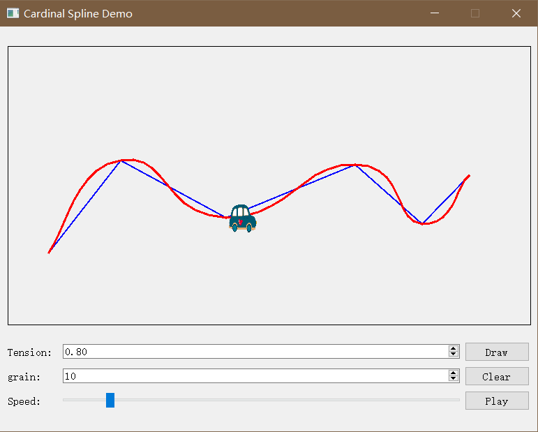

# Cardinal-Interpola-demo

This is a course project of my Computer Animation at ZJU, which is implemented using Qt. The users can set a sequence of control points and draw a Cardinal interpolation spline. Also, it implements a simple film that a car moves along the spline at different speed.

#### Screenshot

